# AURA — Full-Stack E-Commerce Platform

A complete e-commerce system built from scratch in **Laravel 13** — REST API, role-based authentication, a customer storefront, an admin panel, and AI-powered features using Laravel's new first-party **AI SDK**.

> 📷 **Note:** Product images are placeholders (seeded via a stock photo API), not real product photography. The focus of this project is backend architecture, API design, and AI integration — not sourcing real inventory.

---

## 📸 Screenshots

### Storefront

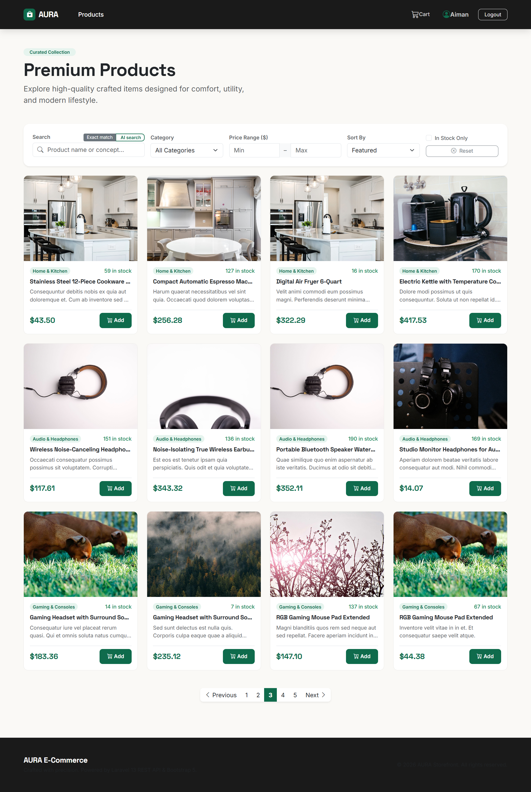

### Product Detail Page

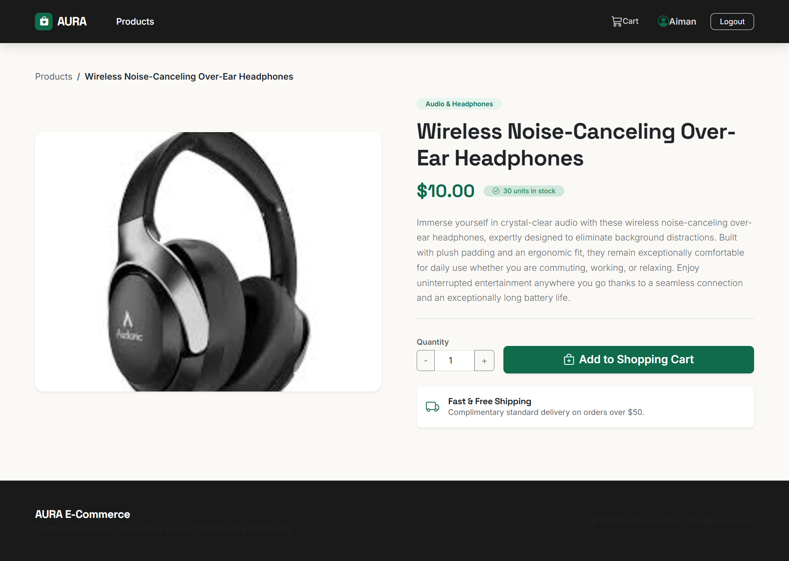

### Semantic Search — AI vs Exact Match
Searching **"something to block out noise while traveling"** — a phrase with zero literal keyword overlap with any product name.

| Exact Match | AI Search |
|---|---|
| 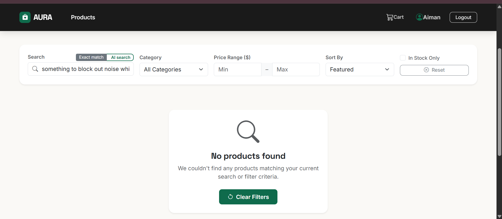 | 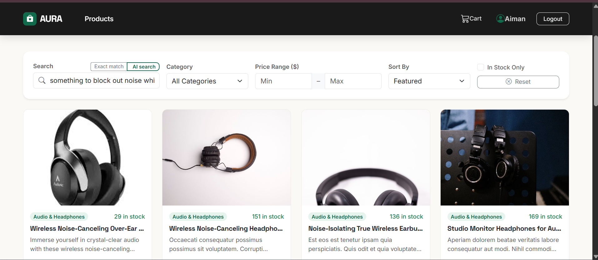 |

### AI-Generated Product Description

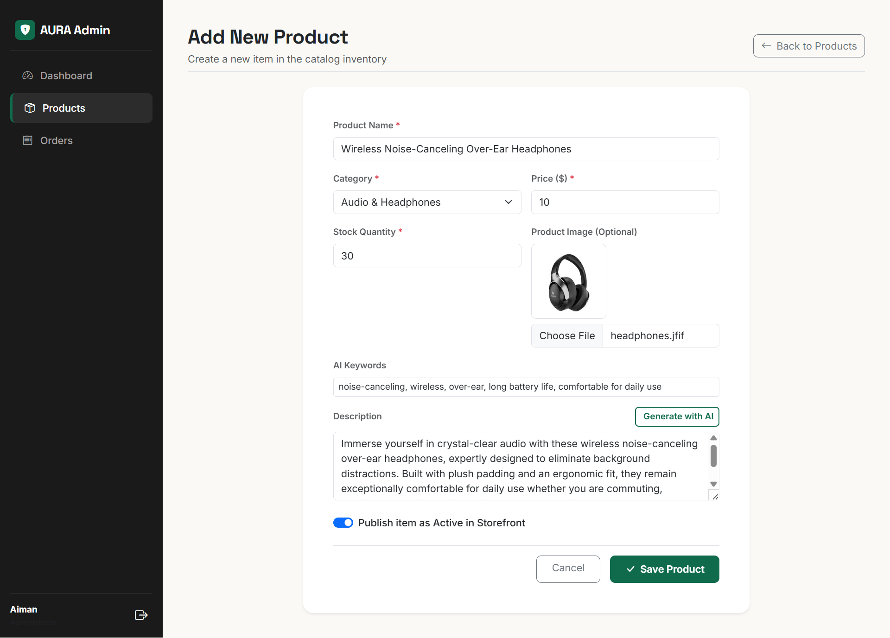

### Admin panel

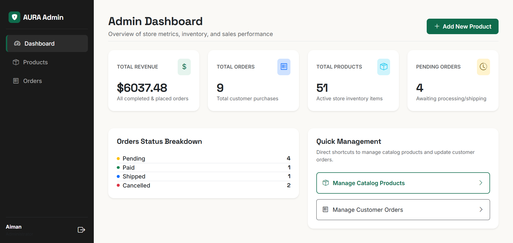
--
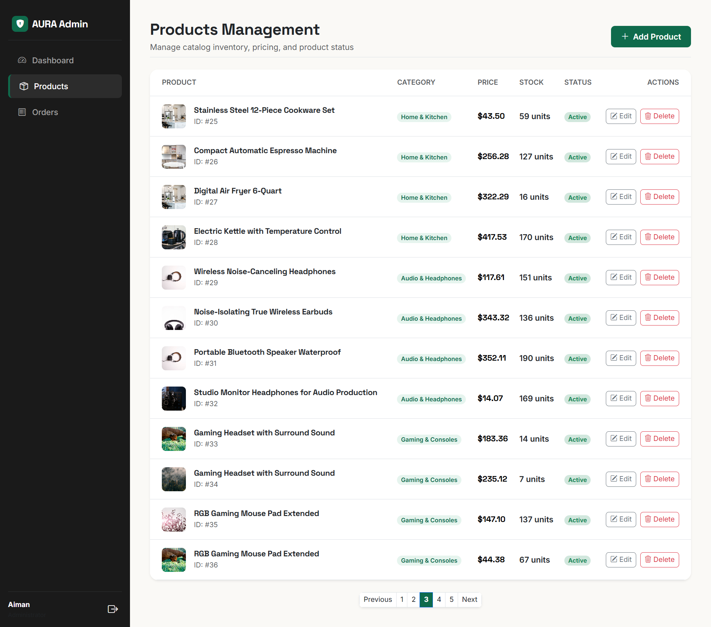
---
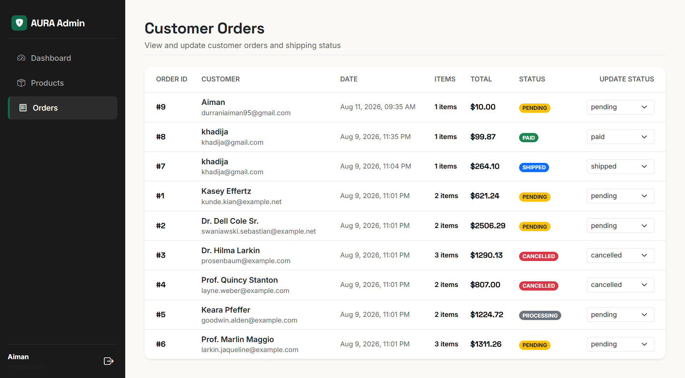
---


### API Testing (Postman)

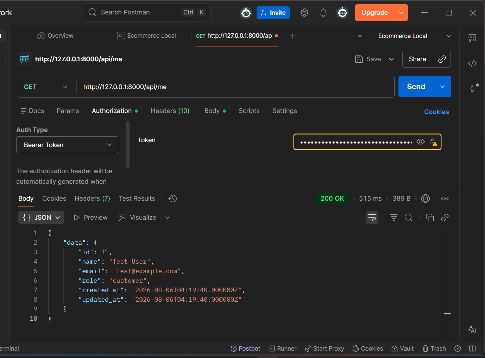
------
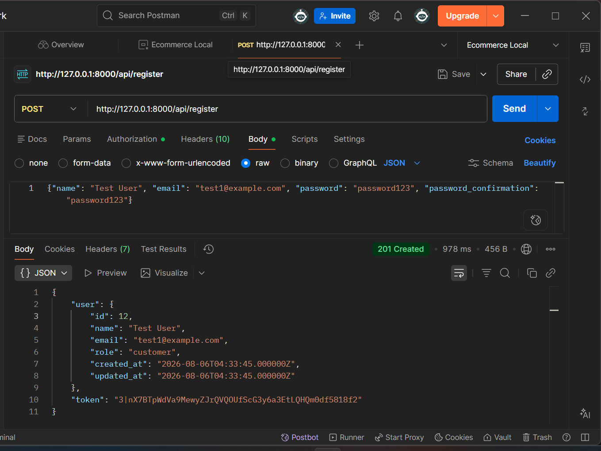
-----
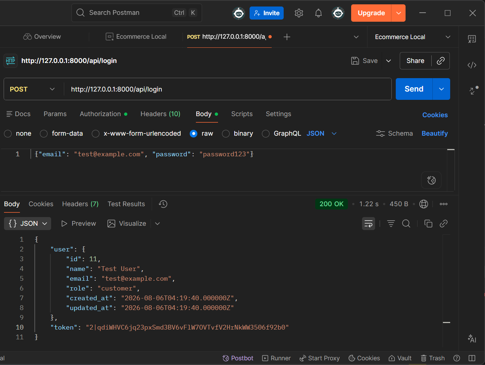
-----
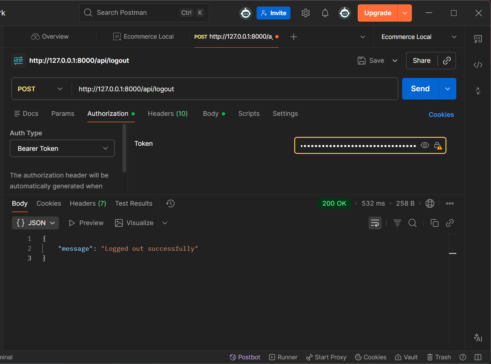


---

## ✨ Features

### Backend / API
- RESTful API built with **Laravel 13**, authenticated via **Sanctum** (token-based auth)
- Role-based authorization (`customer` / `admin`) enforced with **Laravel Policies** — every write action is checked server-side, not just hidden in the UI
- Full CRUD for products, categories, cart, and orders
- Filtering, sorting, and pagination on product listings (category, price range, stock status, keyword search)
- Cart → checkout flow wrapped in a **database transaction with row-level locking** (`lockForUpdate()`), preventing overselling when stock is limited
- **Price snapshotting** on orders — historical orders remain accurate even if a product's price changes later
- Consistent JSON responses via **API Resources**
- Feature tests (PHPUnit) covering authentication, authorization, and checkout logic

### Frontend
- **Customer storefront** — product browsing with live filters, cart, checkout, and order history. Built with Blade + Bootstrap 5, with all data fetched via the REST API (not rendered directly from Eloquent)
- **Admin panel** — product management, order status updates, dashboard stats. Gated by role on both the frontend (UX) and backend (actual security)

### AI Integration
Built using **Laravel 13's first-party AI SDK** (`laravel/ai`), released in 2026, running on **Google Gemini**.

- **AI-generated product descriptions** — admin provides a product name + a few keywords, and receives a draft description to review and edit before publishing (never auto-saved)
- **Semantic product search** — product text is converted into vector embeddings on save; search queries are matched by *meaning* (cosine similarity) rather than exact keyword matching. A query like *"good for a long flight"* returns relevant headphones even though that exact phrase never appears in any product's name or description

---

## 🗄️ Database Design

The schema was designed before any code was written — 9 tables, all relationships mapped out upfront.

**Core tables:** `users`, `categories`, `products`, `carts`, `cart_items`, `orders`, `order_items`, `reviews`, `product_embeddings` (JSON-based, for semantic search)

Key design decisions:
- `order_items.price` is a deliberate snapshot of the product's price at time of purchase — not a live reference
- `products` uses soft deletes, so historical orders still resolve product names even if a product is later removed
- `carts.user_id` is nullable, supporting future guest-cart functionality

See the full ERD screenshot above for the complete table/relationship map.

---

## 🛠️ Tech Stack

| Layer | Technology |
|---|---|
| Backend Framework | Laravel 13 (PHP 8.3+) |
| Database | MySQL |
| Authentication | Laravel Sanctum |
| Frontend | Blade, Bootstrap 5, vanilla JS (fetch API) |
| AI | Laravel AI SDK, Google Gemini |
| Testing | PHPUnit |
| API Testing | Postman |

---

## 🚀 Getting Started

### Prerequisites
- PHP 8.3 or higher
- Composer
- MySQL
- A [Google Gemini API key](https://aistudio.google.com) (free tier available)

### Installation

```bash
# Clone the repository
git clone https://github.com/your-username/aura-ecommerce.git
cd aura-ecommerce

# Install dependencies
composer install

# Environment setup
cp .env.example .env
php artisan key:generate

# Configure your database and Gemini API key in .env
DB_DATABASE=ecommerce_store
DB_USERNAME=root
DB_PASSWORD=

GEMINI_API_KEY=your-key-here

# Run migrations and seed the database
php artisan migrate:fresh --seed

# Link storage for product image uploads
php artisan storage:link

# Backfill AI embeddings for seeded products (one-time, required for semantic search)
php artisan app:backfill-embeddings

# Serve the application
php artisan serve
```

Visit `http://127.0.0.1:8000` to view the storefront.

### Creating an Admin Account

Admin accounts aren't created via public registration (by design, for security). After registering a normal account:

```bash
php artisan tinker
>>> App\Models\User::where('email', 'your-email@example.com')->update(['role' => 'admin']);
```

Then log in normally — you'll be redirected to `/admin/dashboard` automatically based on your role.

---

## 🧪 Running Tests

```bash
php artisan test
```

Test suite covers:
- Authentication (register, login, logout, token revocation)
- Product authorization (guest read access, customer restrictions, admin permissions)
- Cart and checkout logic (stock validation, transaction rollback, price snapshotting)
- Order authorization (ownership checks, admin-only routes)

---

## 📮 API Overview

| Method | Endpoint | Description | Auth |
|---|---|---|---|
| POST | `/api/register` | Create a new account | Public |
| POST | `/api/login` | Authenticate and receive a token | Public |
| POST | `/api/logout` | Revoke current token | Required |
| GET | `/api/products` | List products (filterable, paginated) | Public |
| GET | `/api/products/search` | Semantic search | Public |
| POST | `/api/cart/items` | Add item to cart | Required |
| POST | `/api/checkout` | Convert cart to order | Required |
| GET | `/api/orders` | View own order history | Required |
| POST | `/api/admin/products` | Create a product | Admin only |
| GET | `/api/admin/orders` | View all orders | Admin only |
| PATCH | `/api/admin/orders/{id}/status` | Update order status | Admin only |

A full Postman collection is available in [`/postman`](./postman) *(add your exported collection here)*.

---

## 🗺️ Project Roadmap / Build Order

This project was built in 10 deliberate stages:

1. Database layer (migrations, models, factories, seeders)
2. Authentication (Sanctum)
3. Categories & Products (CRUD + admin authorization via Policies)
4. Resources, filtering & pagination
5. Cart & checkout (with transactions and stock validation)
6. Order management (admin)
7. Testing & Postman
8. Customer-facing UI
9. Admin panel UI
10. AI SDK integration (description generation + semantic search)

---

## 🤝 Feedback

This project was built as a learning exercise in solid API design, authorization patterns, and integrating new AI tooling into a real Laravel application. Feedback is genuinely welcome — if you spot something that could be done better, feel free to open an issue or reach out.

---

## 📄 License

This project is open source and available under the [MIT License](LICENSE).
